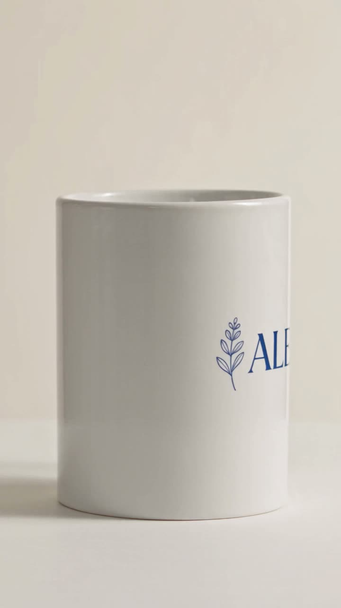
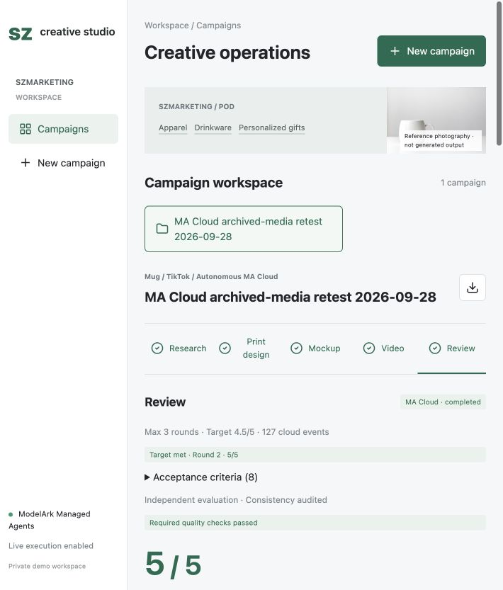
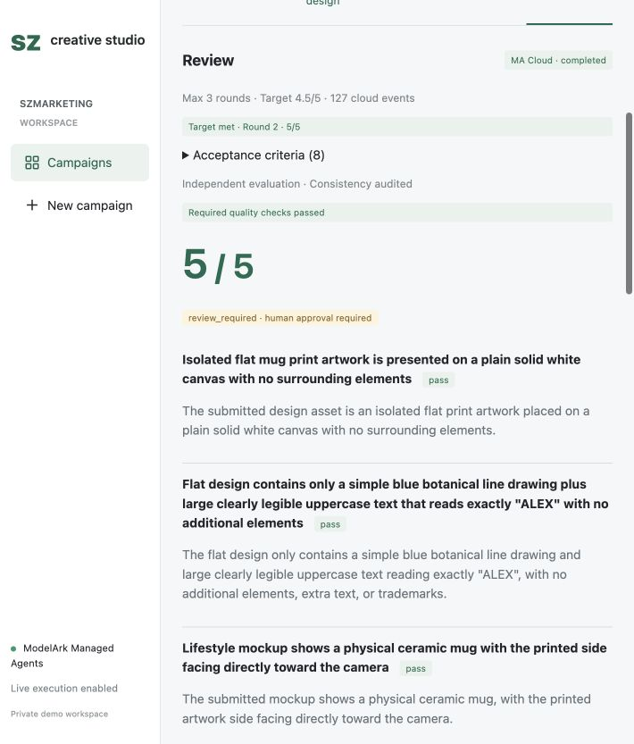
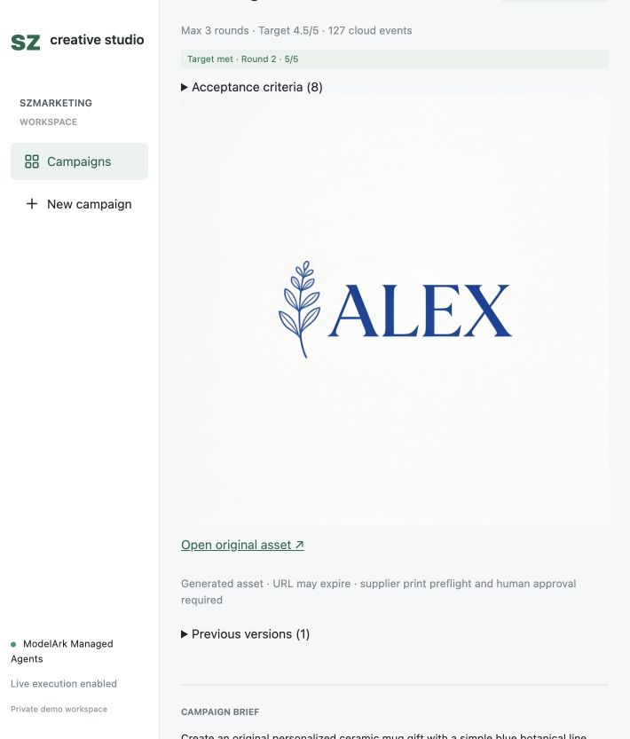
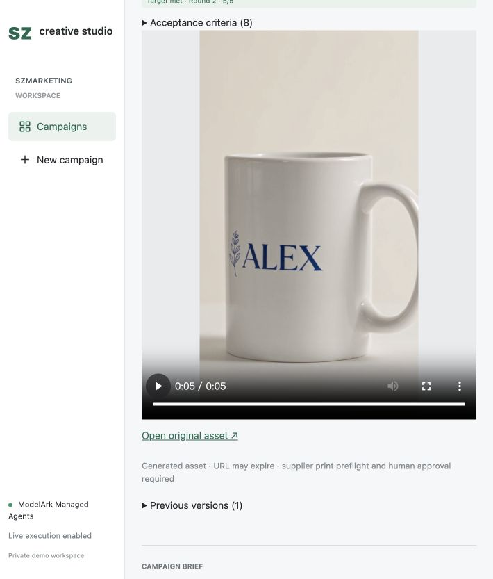
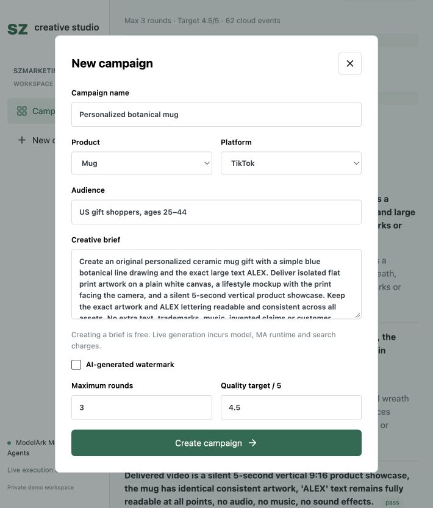

# End-to-End POD Creative Generation and Evaluation with ModelArk Managed Agents

[Chinese version](CUSTOMER_DEMO_ZH.md)

[UI screenshots, asset sources, and file availability](#10-frontend-ui-and-asset-sources)

This guide explains how to deploy and reproduce SZ Creative Studio. ArkCLI deploys the Managed Agent (MA), Cloud Environment, and Skill. Users submit a brief through the web UI; MA generates images and video, evaluates the actual assets, audits the findings, and revises the creative when needed.

**Verified baseline: September 28, 2026, Agent / Skill v9.** The real cloud run improved from **3.33/5 in round 1 to 5/5 in round 2**, then stopped after all required checks passed. Settings were three maximum rounds, a 4.5/5 target, and watermark disabled. Four images and two videos are archived. Generated assets and scores may differ on another run.

Model acceptance is not human visual approval, print-production approval, copyright clearance, or platform publishing approval. Distribute this guide with the source code. Section 9 explains the verification boundaries.

## 1. What the Demo Does

- Converts a brief into creative direction and prompts. The Skill instructs the agent to research public sources, but research was not verified in this run.
- Uses Seedream to generate one print-design image and one product mockup.
- Uses Seedance to generate a five-second, 9:16 product video, with audio generation disabled by default.
- Evaluates actual images and video against dynamically derived acceptance criteria.
- Audits the evaluation against the evidence and requests adjudication when findings conflict.
- Revises prompts to address the highest-priority defects until the target is met or the round limit is reached.
- Displays assets, scores, acceptance checks, and previous versions, with Campaign JSON export.

Defaults are three rounds and a 4.5/5 target. Users can configure these when creating a Campaign; the maximum supported round count is five. Each round produces one asset set, not a pool of parallel candidates. Final publication still requires human approval.

## 2. Architecture and Responsibilities

```text
Browser
  -> Local Node.js service: create Session, submit brief, observe events, display results
      -> MA Cloud Session
          -> MA main model: research, derive criteria, write prompts, plan revisions
          -> pod-creative-loop Skill + Python scripts
              -> Seedream: print design and mockup
              -> Seedance: submit and poll video tasks
              -> /responses: independent evaluation of actual assets
              -> /responses: consistency audit of evidence and findings
              -> /responses: adjudication only when conflicts occur
          -> Main model revises prompts for the next round when needed
          -> Validated result export returns to the local service
```

Generation and evaluation API calls for the cloud Campaign run inside MA Cloud. The local service bridges Session interactions and displays results; it does not orchestrate generation for that Campaign. Keep it running to observe and persist results.

Evaluation, audit, and adjudication use separate model request contexts, potentially with the same model. They are not three separately deployed MA Agents. Evaluation receives the original brief, frozen criteria, and actual assets, but not the creator's reasoning or self-scores. Audit and adjudication also receive the reports they must check.

No external MCP server or public inbound endpoint on your computer is required. The Cloud Environment needs outbound access to model APIs and asset URLs.

## 3. Prerequisites

1. A BytePlus account with Managed Agents, required model access, and resource-management permissions.
2. An installed and authenticated BytePlus ArkCLI, not a CLI configured for another tenant.
3. Node.js 22 or later, npm, Python 3, and zip.
4. A dedicated model API key authorized for this demo and permission to create a dedicated Cloud Environment.
5. The demo source directory. This document is not a standalone executable package.

Main files:

```text
szmarketing-ma-demo/
  package.json
  package-lock.json
  .env.example
  server.mjs
  cloud.mjs
  core.mjs
  cloud-system.md
  deploy-environment.mjs
  public/
  skills/pod-creative-loop/
    SKILL.md
    scripts/creative.py
    scripts/evaluation.py
  test.mjs
  test-cloud.py
```

Do not distribute the original test environment's `.env`, `data/`, authentication directories, or signed private asset URLs.

The implementation uses these defaults, subject to availability in the customer's account:

| Purpose | Default model |
| --- | --- |
| MA main model in the test deployment | `seed-2-0-lite-260428` |
| Image generation | `seedream-4-5-251128` |
| Video generation | `dreamina-seedance-2-5-260628` |
| Evaluation, audit, and adjudication | `seed-2-0-lite-260428` |

Cloud scripts read `IMAGE_MODEL`, `VIDEO_MODEL`, and `EVAL_MODEL` from the Cloud Environment, with `VISION_MODEL` also supported as an evaluation-model fallback. Changing model names only in the local `.env` does not change the cloud configuration. Replacement models must support the relevant APIs and input parameters.

## 4. Deploy MA Cloud

Run these commands from the source root using your own account, key, and resource IDs. Replace placeholders with returned values. Resource creation, model calls, and environment execution may incur charges.

### 4.1 Authenticate and Check the Account

```bash
arkcli --version
arkcli auth login
arkcli auth status --format json
arkcli profile show --format json
```

Confirm the BytePlus tenant, intended `ap-southeast-1` region, account, and project. Do not share complete authentication output, keys, or environment configuration publicly.

### 4.2 Package and Upload the Skill

```bash
mkdir -p data
cd skills
zip -r ../data/pod-creative-loop.zip pod-creative-loop -x '*/__pycache__/*'
cd ..
arkcli agent skill create --zip data/pod-creative-loop.zip --display-title 'SZ Autonomous POD Loop' --format json
```

Record the returned Skill ID and version. The ZIP must contain the top-level `pod-creative-loop/` directory, including `SKILL.md`, `creative.py`, and `evaluation.py`. Never include credentials.

To update an existing Skill, use `arkcli agent skill update <SKILL_ID> --zip data/pod-creative-loop.zip --format json`, then bind the Agent to the returned version. Existing Sessions do not automatically switch to the new Skill; create a new Campaign / Session. The v9 label describes the test account's version, not a version number new accounts should hard-code.

### 4.3 Create a Dedicated Cloud Environment

This demo injects the API key through Environment `Config.Env`. This is not a dedicated secret vault: anyone able to read the configuration or execute code in the environment may access the key. Obtain authorization, use a dedicated test key, and do not share the environment with untrusted workloads.

To change the environment name, first edit the demo name in `deploy-environment.mjs`. In Bash, enter the key without recording it in command history:

```bash
read -r -s -p 'BytePlus demo API key: ' ARK_API_KEY
printf '\n'
export ARK_API_KEY
node deploy-environment.mjs
unset ARK_API_KEY
```

The script creates the Cloud Environment with outbound networking and `ARK_API_KEY`, outputs the environment ID without the key, and deletes its temporary configuration file afterward. Record `environment_id`.

If creation times out or its outcome is uncertain, check the console before retrying. Do not dump complete Environment or Session configurations for troubleshooting; they may contain credentials.

### 4.4 Create the Agent and Bind the Skill

Check available MA main models:

```bash
arkcli agent model list --format json
```

Create the Agent using your uploaded Skill ID and version:

```bash
arkcli agent agent create \
  --name 'sz-pod-creative-demo' \
  --model '<AVAILABLE_MA_MODEL_ID>' \
  --system @cloud-system.md \
  --skill '{"SkillId":"<SKILL_ID>","Version":"<SKILL_VERSION>"}' \
  --format json
```

Retain the default tools so MA can read the Skill, execute scripts, and research sources. Record the Agent ID and check the binding:

```bash
arkcli agent agent get <AGENT_ID> --format json --transform 'Result.Skills'
```

## 5. Start the UI and Local Service

```bash
npm ci
cp .env.example .env
```

Set your resource IDs in `.env`:

```dotenv
PORT=8790
CLOUD_AGENT_ID=<AGENT_ID>
CLOUD_ENVIRONMENT_ID=<ENVIRONMENT_ID>
MA_AGENT_ID=<AGENT_ID>
MA_ENVIRONMENT_ID=<ENVIRONMENT_ID>
ENABLE_PAID_RUNS=true
```

`CLOUD_*` configures new cloud Campaigns. The current connection indicator also reads `MA_*`, so set both pairs to the same resources for this demo. The local `ARK_API_KEY` can remain empty when the authenticated ArkCLI profile provides Session credentials. The cloud API key was configured separately in the dedicated Environment.

```bash
npm test
python3 test-cloud.py
npm start
```

Open [SZ Creative Studio](http://127.0.0.1:8790/). If the port is occupied, change `PORT`, restart, and use the new port. This loopback-only demo service is not an authenticated, multi-tenant production application.

## 6. Run a Complete Test

`watermark` is a customer choice. Checking **AI-generated watermark** sends `true`; unchecking sends `false`, for both images and video. It is checked by default. Uncheck it for this example to match the requirement for no additional text. The value is fixed after initialization; changing it requires a new Campaign. Omitting the parameter does not mean disabling it, and a prompt cannot override it.

Click **New campaign** and enter:

| Field | Example |
| --- | --- |
| Campaign name | Personalized botanical mug |
| Product | Mug |
| Platform | TikTok |
| Audience | US gift shoppers, ages 25-44 |
| Maximum rounds | 3 |
| Quality target / 5 | 4.5 |
| AI-generated watermark | Unchecked (false) |

Creative brief:

```text
Create an original personalized ceramic mug gift with a simple blue botanical
line drawing and the exact large text ALEX. Deliver isolated flat print artwork
on a plain white canvas, a lifestyle mockup with the print facing the camera,
and a silent 5-second vertical product showcase. Keep the exact artwork and
ALEX lettering readable and consistent across all assets. No extra text,
trademarks, music, invented claims or customer testimonials.
```

Click **Create campaign**, then click **Run cloud loop** once. Saving the Campaign record does not start generation; running the cloud loop incurs model and execution charges.

The page shows the Session ID and observed event count. Final assets and evaluations mainly appear after MA exports the complete result. Do not start another run just because images have not appeared yet.

The intended sequence is:

1. Research public sources and record references. State when reliable evidence is unavailable; do not claim verified best-selling data without it.
2. Derive acceptance criteria from the brief, including source requirements, required/optional status, priority, weight, and applicable assets.
3. Freeze the brief and criteria, then generate the print design, mockup, and video.
4. Independently evaluate actual assets, reporting per-check status, score, evidence, and improvements.
5. Audit consistency and requirement coverage. Request adjudication if findings conflict.
6. If below target and rounds remain, revise prompts and generate again without weakening the frozen criteria.
7. Export the selected evaluated round and report for display.

A run may pass immediately or remain below target after several rounds. A first-round pass verifies the direct path, not an actual revision cycle. To demonstrate revisions, the report must contain multiple rounds and corresponding changes.

## 7. Interpret and Preserve Results

### 7.1 Execution Completion Versus Quality Acceptance

If a round passes every required check and reaches the score target, return it immediately. At the round limit, select the highest-scoring round among those passing the required-item gate. Only if none passes that gate, select the highest-scoring round overall. Ties retain the earlier round.

Return the selected round's assets, failed and unverified checks, and score gap. A best-available result is not necessarily an accepted result.

| Status | Meaning |
| --- | --- |
| `completed` | Required checks pass, no unresolved coverage gaps remain, and the score target is met |
| `needs_revision` | Revision is needed; MA should continue improving prompts |
| `max_rounds` | Round limit reached; generation stops, but quality is not necessarily accepted |
| `blocked` | Criteria omit a requirement; correct requirement decomposition in a new Campaign rather than silently changing frozen criteria |
| Execution error | API, authentication, response-format, or other failure; not an evaluation pass |

The script calculates the weighted score as `sum(score * weight) / sum(weight)` using frozen weights. The model cannot override the total. Optional preferences affect the score but do not independently block the required-item gate. A required `fail` or `unverified` check prevents acceptance. Unresolved conflicts cannot establish a required pass.

### 7.2 Inspect the UI

- **Print design:** verify that the image is the requested deliverable.
- **Mockup:** check product presentation and artwork consistency.
- **Video:** play the complete video and check duration, text, motion, and audio requirements.
- **Acceptance criteria:** check coverage and whether required items were incorrectly made optional.
- **Review:** inspect evidence, scores, required-item status, prioritized revisions, and audit/adjudication indicators.
- **Previous versions:** compare actual assets and reports, not only total scores.

Independent contexts and audit reduce self-evaluation bias but cannot eliminate model errors. Human checks remain necessary for high-risk requirements. If audio was not reliably observed, a silent-generation request alone does not prove the output is silent.

### 7.3 Save Reproduction Evidence

Record the Campaign and Session IDs, Agent / Skill versions, model names, original brief, round limit, and target. In exported JSON, inspect `cloud.result.criteria`, `rounds`, `best_round`, `status`, `return_policy`, and `result_summary`, plus each round's `evaluation`, `audit`, and optional `adjudication`.

Campaign JSON does not bundle remote media. Preserve assets separately while signed URLs remain valid. Keep all signature parameters when accessing media; removing them does not repair an expired URL.

If the browser does not complete the JSON download, export the same Campaign record from the service directory in Bash:

```bash
CAMPAIGN_ID='<CAMPAIGN_ID>' node --input-type=module -e '
import {readFileSync,writeFileSync} from "node:fs";
const job=JSON.parse(readFileSync("data/jobs.json","utf8"))[process.env.CAMPAIGN_ID];
if(!job) throw Error("Campaign not found");
writeFileSync("campaign-export.json",JSON.stringify(job,null,2),{mode:0o600});
'
```

Exports may contain customer briefs, Session IDs, and signed asset URLs. Review and redact them before sharing.

## 8. Retries and Recovery

| Condition | Behavior and action |
| --- | --- |
| Seedance task explicitly fails with a recognized transient service error | Up to two replacement tasks per round, reusing images, with 5/10-second backoff; additional charges may apply |
| Video polling encounters network failures, 429, or 5xx | Bounded retries against the same task ID, without creating another video |
| Video creation outcome is uncertain | No blind resubmission; confirm the original task first |
| Policy rejection, unknown error, expiration, or cancellation | Stop and investigate rather than retry indefinitely |
| Video observation exceeds 30 minutes | Observation stops; the remote task is not necessarily canceled |
| `/responses` returns HTTP 200 | Success also requires `response.completed`, completed status, and a valid report |
| SSE disconnect, `response.incomplete`, or invalid JSON | Not a success; up to two attempts per evaluation, audit, or adjudication phase |
| Local observation stops or the service restarts | Use **Resume observation** for the original Session without resending the brief; cloud execution errors need separate diagnosis |
| Authentication expires | Run `arkcli auth login`, verify authentication, then resume observation |
| State integrity validation fails | Preserve the record and investigate; do not edit `state.json` or fabricate scores |

Quality rounds and API retries are separate limits. Three rounds do not mean three API calls or a fixed spending cap.

## 9. Real Cloud Retest: September 28, 2026

The run reused Agent / Skill v9 with three maximum rounds, a 4.5/5 target, and watermark disabled. MA derived and froze eight required criteria from the same brief. Two rounds and 127 events were recorded; each round generated two images and one video and completed independent evaluation and consistency audit. Neither audit found conflicts, so adjudication was not invoked.

| Round | Model score | Required-item gate | Action |
| --- | --- | --- | --- |
| 1 | 3.333333/5 | blocked | Design deliverable contained a rendered mug instead of isolated flat artwork; MA revised the prompts |
| 2 | 5/5 | passed | All eight required criteria passed; the target was met and execution stopped early |

Round 3 was not executed. The return policy was `required_pass_then_score_or_early_pass`, selecting round 2:

```json
{
  "selected_round": 2,
  "score": 5,
  "stop_reason": "completed",
  "met_target": true,
  "score_gap": 0,
  "failed_checks": [],
  "unverified_checks": [],
  "uncovered_requirements": []
}
```

This run exercised defect detection, prompt revision, regeneration, independent evaluation, audit, and early stopping. It did not exercise conflict adjudication or selection at the round limit; local tests are not a substitute for those cloud branches.

### 9.1 Before and After

Round 1 included a physical mug in the design deliverable and failed acceptance:


Round 2 produced isolated blue botanical artwork and ALEX lettering without a mug render:


Round 2 product mockup:


Round 2 video: click the poster to open the original MP4.

[](docs/assets/retest-20260928/round-2-video.mp4)

File inspection found both videos to be 720x1280, approximately 5.041667 seconds, with no audio stream. This confirms dimensions, duration, and audio-stream status, not frame-by-frame visual quality, rights clearance, or publication approval.

### 9.2 All Assets and Reports

| Round | Design | Mockup | Video |
| --- | --- | --- | --- |
| 1 | [JPG](docs/assets/retest-20260928/round-1-design.jpg) | [JPG](docs/assets/retest-20260928/round-1-mockup.jpg) | [MP4](docs/assets/retest-20260928/round-1-video.mp4) |
| 2 (selected) | [JPG](docs/assets/retest-20260928/round-2-design.jpg) | [JPG](docs/assets/retest-20260928/round-2-mockup.jpg) | [MP4](docs/assets/retest-20260928/round-2-video.mp4) |

[Download the sanitized report and per-round prompts](docs/assets/retest-20260928/result.json). It includes the brief, frozen criteria, evaluations, audits, final selection, file sizes, and SHA-256 checksums. Private resource IDs and signed URLs were removed. This documentation copy cannot be used to revalidate the original cloud manifest.

All media is archived locally as original files rather than temporary signed links. Archive a reproduced run immediately after completion:

```bash
node archive-campaign.mjs <CAMPAIGN_ID> <ARCHIVE_NAME>
```

The output is `docs/assets/<ARCHIVE_NAME>/`. The command downloads and exports only; it does not generate media. Download failures cause an error rather than a false complete-archive claim.

### 9.3 Verification Boundaries

- The export contained `research=[]`; market research, competitor sales, and live trends were not verified.
- The 5/5 result is a model score. Inspection of the original design images confirmed the visible difference between rounds, not print-production acceptance, frame-by-frame review, copyright clearance, or platform approval.
- Independent evaluation, audit, and dynamic criteria can still misjudge content. Production deliverables need human review.
- Local regression coverage comprises 55 tests: 26 Node.js and 29 Python tests. This does not guarantee repeatable media scores.
- Watermark was disabled; this does not imply removing provenance information or waiving disclosure requirements.
- These files and results belong to the September 28 run, not the expired September 26 media.

## 10. Frontend UI and Asset Sources

The Workspace now shows only the latest Campaign. Older Campaigns are archived locally, not deleted. Round 1 remains available under Previous versions within the latest Campaign.









Configuration form example, filled without submitting an additional generation task for the screenshot:



### Reference Material

The generation dependency chain is **user brief -> generated design -> mockup using that design -> video using the generated mockup**. The design and mockup shown above are therefore both deliverables and inputs to later stages. No additional customer image, video, or audio was uploaded.


This photograph comes from the [Unsplash image URL](https://images.unsplash.com/photo-1514228742587-6b1558fcca3d?w=1000&auto=format&fit=crop&q=85) referenced by `public/index.html`. It is UI decoration, not a model input or competitor/market-research evidence. Rights remain with the respective rights holder; confirm applicable permissions before redistribution.

See the [asset inventory](docs/assets/README.md) for provenance.

## 11. Demo and Production Boundaries

This prototype does not include automatic ad placement, live competitor-sales integrations, factory print delivery, or automatic publishing. Its connectors produce two images and one five-second vertical video per round; dynamic criteria do not imply arbitrary deliverable support.

A suitable customer summary is: "MA generates and independently evaluates assets in the cloud, then revises them based on defects. This run improved from 3.33 in round 1 to 5 in round 2, stopped after acceptance, and archived both rounds for review." Do not promise a score of 5 or unattended publication on every run.

Production additionally requires access control, appropriate secret management, durable asset storage, cost controls, observability, and human approval. Review customer briefs, assets, and evaluation text before sharing. Exclude private `.env`, `data/`, authentication caches, and signed URLs.
